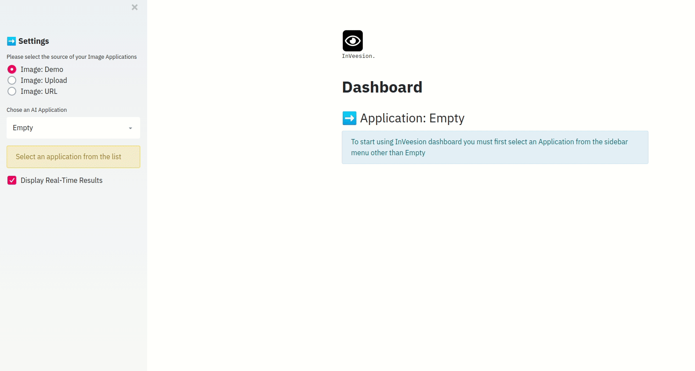

# Computer Vision application in the web

# Preview


# Usage

- Clone this repo
    ```bash
    git clone https://github.com/amineHY/WebApp-Computer-Vision-streamlit.git

    cd WebApp-Computer-Vision-streamlit
    ```
- Install dependencies
    ```txt
    pip3 install -r requirements.txt
    ```
- Run the app on your local machine
    ```bash
    streamlit run main.py
    ```
## Run inside Docker
Pull the [docker-streamlit-app](https://hub.docker.com/repository/docker/aminehy/docker-streamlit-app) image (available in  [Github](https://github.com/amineHY/docker-streamlit-app))
```bash
dockr pull aminehy/docker-streamlit-app:latest
```
then run with
```bash
docker run -ti --rm -v $(pwd):/app aminehy/docker-streamlit-app:latest
```

## Video supports
=> [www.inveesion.com](www.inveesion.com)


## Want to contribute ?
This is an open source project, so you can contribute to this project by creating an issue than a pull request.
